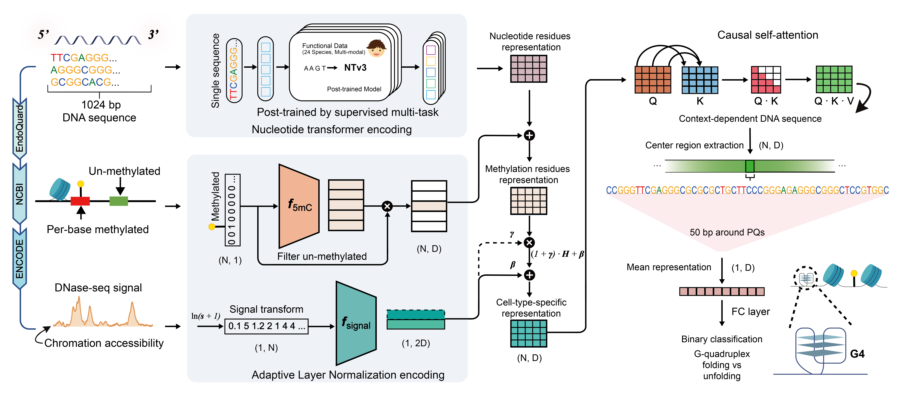

# G4former: Predicting human G-quadruplexes across cell types by multi-modal transformer

This repository accompanies the study on predicting endogenous G-quadruplex (G4) formation in the human genome by integrating DNA sequence and epigenomic signals using a pretrained nucleotide transformer. The current implementation is based on **Nucleotide Transformer v3 (Ntv3)** and incorporates **DNase-seq** and **whole-genome bisulfite sequencing (WGBS)** signals, along with multiple ablation variants and downstream analysis scripts.

## Framework



## Overview

This repository is organized around three core components:

1. **Data construction**  
   Starting from publicly available peak datasets (e.g., BG4 ChIP-seq and CUT&Tag), we construct positive and negative samples through intersection, window expansion (±512 bp; ~1024 nt), and strand-specific splitting. Epigenomic signals are aligned to fixed-length vectors using `bedtools intersect` and processed via `processed/epi_process.py`.  
   The narrowPeak datasets used in this study are available at https://zenodo.org/records/20011733.

2. **Model framework**  
   The model leverages NT-v3 via Hugging Face `transformers.AutoModel` to generate sequence embeddings. These embeddings are integrated with epigenomic tracks (e.g., DNase-seq and DNA methylation) and passed through a multi-modal architecture for binary classification (G4 formation vs. non-formation).

3. **Experimental setup**  
   Training scripts in `train/` implement the full model and multiple ablations. The `results/` directory contains scripts for reproducing figures and downstream analyses.


## System Requirements

The training and visualization code targets a standard **Windows / macOS / Linux** workstation. **GPU is strongly recommended** for NT-v3 fine-tuning and attention visualization at scale; CPU-only runs are possible but slow. 
The active development stack was aligned with the full **`environment.yml`** snapshot (Python **3.12**, PyTorch **2.5.x**, **transformers 5.x**). A minimal subset sufficient for `train/` entry points is listed below (you can install via **conda + pip** as in the next section, without relying on the YAML file for the PyTorch line items).

**Python dependencies (reference pins):**

```
conda create -n g4former python=3.12.2 -y
conda activate g4former
conda install pytorch==2.5.1 torchvision==0.20.1 torchaudio==2.5.1 pytorch-cuda=12.4 -c pytorch -c nvidia
conda install -c bioconda bedtools samtools ucsc-liftover -y
conda install -c conda-forge r-tidyverse r-showtext

pip install torch-geometric biopython pyBigWig intervene -y

transformers==5.0.0
numpy=1.26.4
pandas=2.2.2
scipy=1.13.1
scikit-learn=1.5.1
tqdm=4.66.5
huggingface-hub==1.3.4
safetensors==0.4.5
tokenizers==0.22.2
sentencepiece==0.2.0
matplotlib=3.9.2
seaborn=0.13.2
```

## Data Processing Pipeline

Detailed commands are available in `processed/Readme`. The general workflow includes:

1. Defines positive/negative samples by intersecting G4 datasets with cell-type-specific peaks  
2. Expands regions to fixed-length windows (1024 bp)  
3. Separates strands to preserve methylation specificity  
4. Aligns epigenomic signals (ATAC/DNase, WGBS) to genomic regions  
5. Converts data into single-nucleotide resolution epigenetic modification features using `epi_process.py`

After preprocessing, you will obtain tabular inputs required for model training.

## Pre-run 

Before running the code:

Update NT-v3 model paths in `AutoModel.from_pretrained(...)`  
- Nucleotide Transformer v3 (**NTv3 100M post**) for sequence features:  
   https://huggingface.co/InstaDeepAI/NTv3_100M_post/tree/main  
- Base / tokenizer assets if needed:  
   https://huggingface.co/InstaDeepAI/ntv3_base_model/tree/main  

### Run G4former on Our Data to Reproduce Results🏃

For full multi-modal model training, you can run the main training script:

```python
python main.py
```
This script trains **G4former** using sequence + DNase/ATAC + methylation features.

### Ablation models

You can run individual components to evaluate their contributions:

```python
python train/G4former-seq.py        # sequence only
python train/G4former-DNase.py      # chromatin accessibility only
python train/G4former-WGBS.py       # methylation only
python train/G4former-Without_CSA.py
```
You also can cross-cell-type evaluation

```python
python train/test_Other_cells.py
```


## Reproducing figures

All scripts for figures are located in:

```
results/
```

## Visualization

Visualization is split into **interpretability / attention** scripts under `visualization/`, and **paper-style figures** under `results/` (Python scripts and Jupyter notebooks).

### Differential attention maps (`visualization/`)

The script **`visualization/differential_attention_maps.py`** loads trained **G4former** weights, runs forward passes with and without part of the epigenomic input, and saves **differential attention** heatmaps (PDF) via `matplotlib` / `seaborn` inside `G4former.plot_attention(...)`.

```python
python visualization/differential_attention_maps.py
```

**Note:** paths to checkpoints, `.pt` index files, and PDF output directories inside the script are currently **hard-coded**; adjust them to your machine before running.

### In silico mutagenesis (ISM)

Open and run **`visualization/ISM.ipynb`** in Jupyter / VS Code. 
